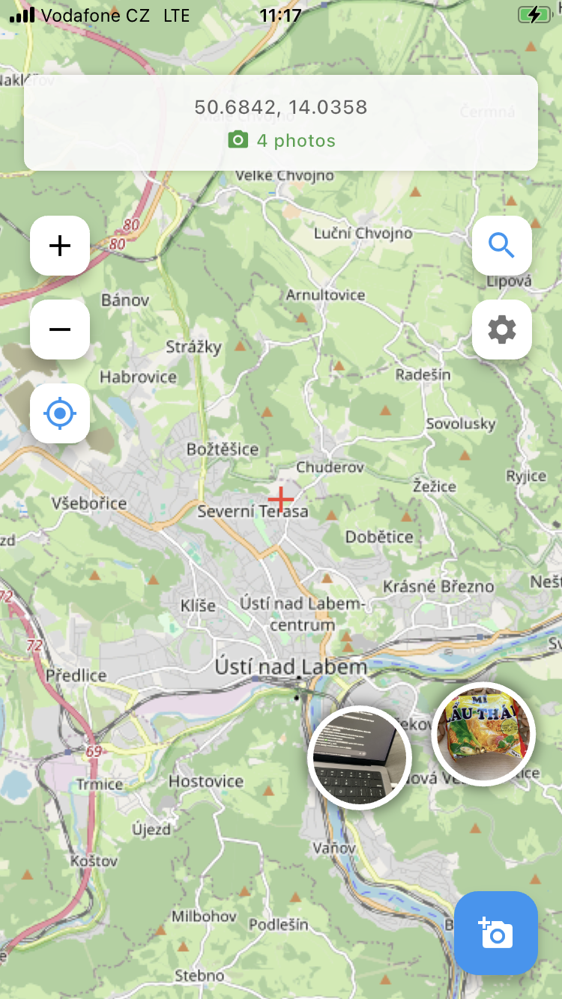

# Map_king

Flutter app for taking photos and placing them as markers on OpenStreetMap.



## Features

- **Interactive Map**: Navigate using OpenStreetMap with pan and zoom
- **Photo Markers**: Take photos or select from gallery and place them at map locations
- **Location Services**: Get your current location and navigate to it on the map
- **Photo Management**: View, edit descriptions, and delete photo markers
- **Search Functionality**: Search for places and navigate to them
- **Customizable Settings**: 
  - Toggle coordinate display in info banner
  - Adjust default zoom level
  - Enable/disable haptic feedback
- **Persistent Storage**: All photos and markers are saved locally

## UI

- Crosshair shows current map center
- Info banner displays coordinates and photo count
- Floating buttons for zoom, location, search, settings
- Camera button for taking photos

## Architecture

The app follows a clean, modular architecture:

```
lib/
├── constants/          # App-wide constants and configuration
├── models/             # Data models (PhotoMarker, SearchResult)
├── screens/            # UI screens (Map, Settings, Search)
├── services/           # Business logic (Location, Storage, Search)
├── styles/             # Centralized styling and themes
├── utils/              # Helper utilities (Logger, SnackBar, PhotoPicker)
└── widgets/            # Reusable UI components
```

## Key Technologies

- **Flutter** - Cross-platform mobile development framework
- **OpenStreetMap** - Free, editable world map
- **flutter_map** - Map widget for Flutter
- **Geolocator** - Location services and permissions
- **SharedPreferences** - Local storage for settings
- **Image Picker** - Camera and gallery access

## Getting Started

### Prerequisites

- Flutter SDK (latest stable version)
- Dart SDK (included with Flutter)
- iOS development tools (for iOS deployment)
- Android development tools (for Android deployment)

### Installation

Works on my machine. May need additional setup depending on your system.

1. Clone the repository:
```bash
git clone https://github.com/stehlfi1/Map_king.git
cd map_photo_app
```

2. Install dependencies:
```bash
flutter pub get
```

3. Run the app:
```bash
flutter run
```

## Usage

1. **Taking Photos**: Tap the blue camera button to take a photo or select from gallery
2. **Viewing Photos**: Tap any photo marker on the map to view details
3. **Navigation**: Use zoom buttons, location button to navigate
4. **Search**: Tap search button to find and navigate to places
5. **Settings**: Configure app preferences through the settings screen


## Storage

- Photos are stored locally in the app's documents directory
- Marker data is persisted using SharedPreferences
- Automatic storage validation and recovery on app startup

